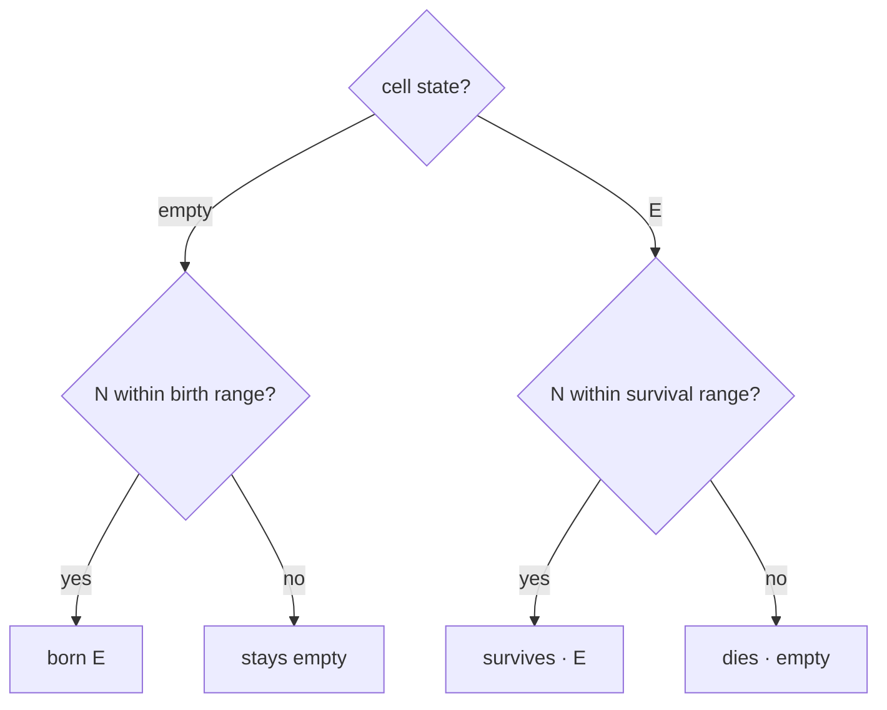
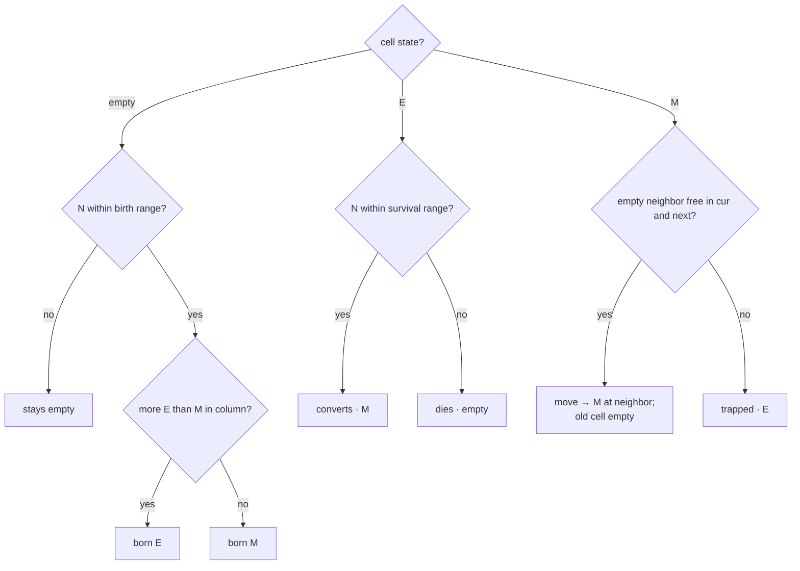
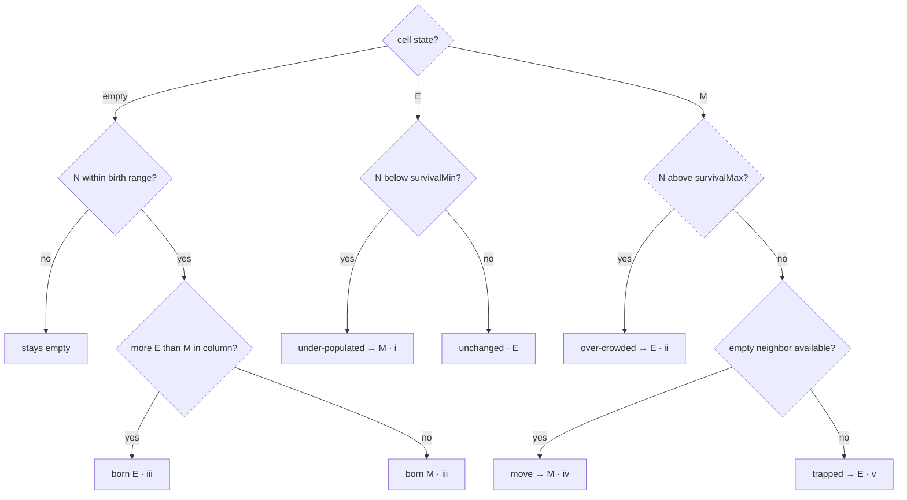

# Cancer AutoMata — SPA

A browser single-page-app reimplementation of the [Eclion/Cancer-AutoMata](https://github.com/Eclion/Cancer-AutoMata)
MATLAB cellular automaton: cancer-cell proliferation under TRAIL stimulation
(Models A/B/C; treatments WT / TRAIL / TR+BIM).

The compute core is **Rust → WebAssembly** running in a **Web Worker**; the UI is
**React 19 + TypeScript** built with **Vite 8**. See
[`Cancer-AutoMata-SPA-PRD.md`](./Cancer-AutoMata-SPA-PRD.md) for the full spec.

> **Status:** Milestones **M0–M7 complete.** The app runs interactive batch
> simulations (M% × treatment × repeats) with a live 2D dish, overlaid
> per-treatment population/M% curves, a per-condition results table, a step
> scrubber, PNG/CSV/JSON/config export + config import, an optimized Rust/WASM
> core (bounded active region + SIMD), and a benchmark mode. See the
> [CHANGELOG](./CHANGELOG.md), the PRD, and [ADR 0001](./docs/adr/0001-rng-parity-and-faithful-quirks.md).

## How the rules are applied

Every step first counts, for each cell, **N** — the number of live neighbors in
its 3×3×3 Moore neighborhood, **excluding the cell itself**. A per-cell fate rule
then applies, depending on the model. The **born-cell type** tie-break compares
the full-height **column** E vs M totals (summed over all z-layers), not just the
local window. M-cell **movement** is sequential and collision-avoiding: a target
must be empty in **both** the previous grid and the in-progress next buffer.
Cells are updated within the colony's active bounding box (Models B/C in seeded
random order). These faithful MATLAB quirks are preserved deliberately (see
[ADR 0001](./docs/adr/0001-rng-parity-and-faithful-quirks.md)).

> `N` comes from a single inclusive 3×3×3 count per step (separable convolution);
> the engine subtracts the cell's own occupancy — 0 for an empty slot, 1 for a
> living cell — so every rule tests the same live-neighbor count.

### Model A — epithelial only



### Model B — E + M, with movement



### Model C — paper rule-set (rules i–v)



## Prerequisites

- **Node ≥ 22** and npm.
- **Rust ≥ 1.77** with the wasm target and **wasm-pack** (the WASM core is built
  from source):
  ```sh
  curl https://sh.rustup.rs -sSf | sh
  rustup target add wasm32-unknown-unknown
  cargo install wasm-pack        # pinned to 0.15.x — see below
  ```
  `wasm-pack` must be on your `PATH`; the npm scripts invoke it.

## Setup

```sh
npm install
```

## Common tasks

| Command | What it does |
|---------|--------------|
| `npm run dev` | Build the WASM core, then start the Vite dev server (with COOP/COEP headers). |
| `npm run build` | Build the WASM core, type-check, and produce a production bundle in `dist/`. |
| `npm run preview` | Serve the production build locally (also with COOP/COEP headers). |
| `npm test` | Build the WASM core, then run the Vitest suite. |
| `npm run wasm` | (Re)build only the Rust → WASM package into `src/wasm/`. |
| `npm run lint` | Biome lint + format check. |
| `npm run format` | Biome auto-format. |

`dev`, `build`, and `test` each rebuild the WASM package first (via `pre*`
scripts), so a clean checkout needs no manual `npm run wasm`.

## Using the app

`npm run dev` (or `npm run preview`) and open the URL. Then:

1. **Parameters** (left): pick a model (A/B/C — switching applies its rule/dish
   defaults), the treatments to run, rules, dish size/height, initial cells,
   steps, repeats, seed, and (Models B/C) a comma-separated list of mesenchymal
   percentages (empty ⇒ each treatment's default 2 / 10 / 95).
2. **Run** (top bar): the batch runs one simulation per (M% × treatment ×
   repeat). The **dish** (center) shows the live colony — green = epithelial,
   red = mesenchymal — with pan (drag), zoom (wheel), and a **step scrubber** to
   replay any captured step. **Charts** (right) overlay one population and one
   M% curve per simulation, coloured by treatment, with a per-condition results
   table (survival ratio pS, growth rate).
3. **Benchmark** runs a fixed timed simulation and reports steps/s and
   Mcell-updates/s. The top bar also shows the core's SIMD / cross-origin-
   isolation status.

### Export & import

- **Dish PNG** — the scrubber's `⬇ PNG` saves the viewed step at native
  resolution (1 cell = 1 pixel).
- **Series CSV / results JSON** — the Results panel exports the completed
  batch (long-format CSV; structured JSON with config + per-condition +
  per-sim series).
- **Config JSON** — export the current configuration, or `⬆ Import` a config
  file (validated against the Zod schema; invalid files report why).

## Testing

- `npm test` runs the full Vitest suite: the TS reference-oracle unit tests, the
  **WASM-vs-oracle differential tests** (byte-identical grids for all three
  models — the core correctness gate), and a deterministic **dish
  render-regression** snapshot.
- `cd core-wasm && cargo test` runs the Rust unit tests (RNG vector, convolution
  vs brute force, region equivalence, sim determinism).

## Deployment

`npm run build` produces a static `dist/` deployable to any static host — no
backend. The app does **not** require `SharedArrayBuffer` (the grid is
transferred to the main thread via `postMessage`), so it works without special
headers. To enable cross-origin isolation (for a future wasm-threads build),
serve these response headers, e.g. via the included
[`public/_headers`](./public/_headers) (Netlify / Cloudflare Pages):

```
Cross-Origin-Opener-Policy: same-origin
Cross-Origin-Embedder-Policy: require-corp
```

The compute core is compiled with WebAssembly SIMD (`+simd128`), supported by all
current browsers.

## Architecture

```
core-wasm/        Rust crate → WebAssembly compute core (wasm-bindgen)
  src/rng.rs        PCG32 (shared reproducibility contract)
  src/grid.rs       colony seeding
  src/neighbors.rs  separable convolution + column planes (+ region variants)
  src/sim.rs        Simulation: bounded active region, fate kernels A/B/C, movement
src/
  core-ts/        pure-TS reference oracle (dev/test only; not shipped)
  wasm/           generated wasm-pack output (git-ignored; rebuilt on demand)
  worker/         sim.worker.ts (Comlink API + benchmark) + capabilities.ts
  schema/         Zod RunConfig, batch job builder, config parse
  store/          Zustand store + batch run-loop controller
  render/         grid → RGBA top-down projection
  export/         PNG / CSV / JSON / config exporters
  ui/             React components (panel, dish, charts, top bar)
  test/           differential + render-regression tests
vite.config.ts    Vite + Vitest config, COOP/COEP headers, worker/wasm wiring
```

## Notes on tooling versions

The stack targets the versions in the PRD/CLAUDE.md (Vite 8.1.x, React 19.2.x,
wasm-bindgen 0.2.126, wasm-pack 0.15.x). `wasm-bindgen`'s crate and CLI versions
**must match exactly** or the build fails cryptically; `wasm-pack` handles the CLI
side automatically. Vitest is pinned to **4.x** because it is the first line that
peer-supports Vite 8 (Rolldown) — using 3.x pulls a second, conflicting Vite.
